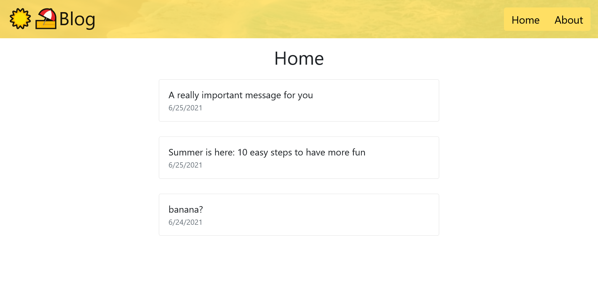

# Summer Blog

- [Summary](#Summary)
- [Technologies](#Technologies)
- [Features](#Features)
- [Screenshots](#Screenshot)

## Summary

Frontend for the [blog API](https://github.com/alessandrovinciabc/blog-api) I made. Actually split into two different projects, the version here is for end users's viewing. The other one is for administration and content creation/editing and can be found [here](https://github.com/alessandrovinciabc/summer-blog-admin).

See them live:

- [Summer Blog](https://alessandrovinciabc.github.io/summer-blog)
- [Summer Blog Admin](https://alessandrovinciabc.github.io/summer-blog-admin)

Note: screenshots of both versions are included at the bottom of this README.

## Technologies

- React
- Bootstrap

Admin frontend:

- [Editor.js](https://editorjs.io/)
- [xss](https://www.npmjs.com/package/xss)

## Features

- View posts
- See and add new comments
- Convert Editor.js's JSON to HTML and sanitize it

Admin frontend:

- Login / Logout
- Create and edit posts
- Delete posts and comments

## Screenshots

